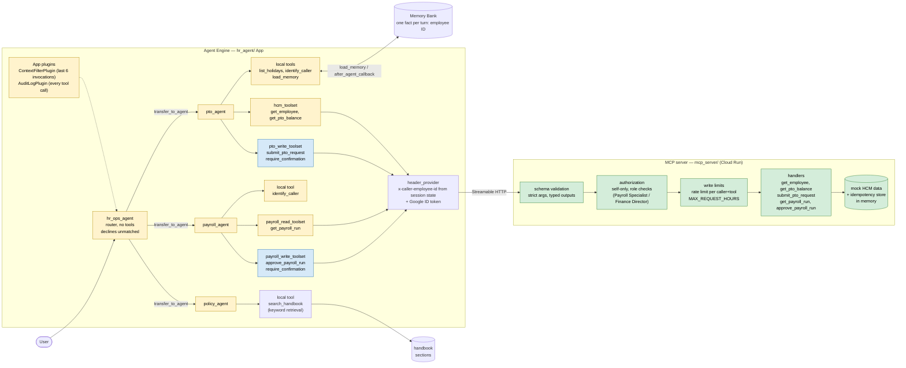

# Architecture

**Legend.** Yellow = soft controls (prompt rules, routing descriptions, `tool_filter`): the
model or in-process config can bypass them. Green = hard controls (schema validation,
caller-identity and role checks, rate and size limits, server-computed hours, idempotency):
enforced server-side regardless of what the model sends. Blue = human-in-the-loop: ADK pauses
every call for explicit user approval (`require_confirmation`).

## Control flow

- **Caller identity** is never a tool argument. It is set in session state (by
  `identify_caller`, a stand-in for a real login — not authentication) and sent by the
  `header_provider` as `x-caller-employee-id`; the MCP server checks it on every call and
  fails closed when absent. `get_employee`, `get_pto_balance` and `submit_pto_request` are
  self-only; `get_payroll_run` needs Payroll Specialist or Finance Director;
  `approve_payroll_run` needs Finance Director.
- **Writes** (`submit_pto_request`, `approve_payroll_run`) stack three layers: user
  confirmation (soft), then server-side identity/role, rate limit (20 calls/60s per
  caller+tool) and `MAX_REQUEST_HOURS` (hard). Confirmation does not replace the server checks.
- **Audit**: `AuditLogPlugin` fires once per tool call across all specialists, local and MCP,
  logging allowlisted identifiers and outcomes only, never balances or error text.
- **Context**: `ContextFilterPlugin` trims what is sent to the model, not `session.events`,
  so session state and memory writes are unaffected.
- **Memory**: `pto_agent` reads via `load_memory` and writes one synthetic fact (the employee
  in context) after each turn, not the transcript. Deployed, this is the Agent Engine Memory
  Bank; locally, an in-memory stub. Memory-sourced IDs are never used for a write.

## Deployment

- `hr_agent/` deploys to Agent Engine with a least-privilege runtime service account
  (`hr_agent/.agent_engine_config.json`).
- `mcp_server/` runs on Cloud Run (image from `deploy/cloud_run/`; service, service accounts,
  IAM and Artifact Registry from `deploy/terraform/`). When `HCM_MCP_AUDIENCE` is set the
  agent attaches a Google ID token for Cloud Run's IAM check; that is infra auth, separate
  from caller identity. Locally the server is plain `http://localhost:8000/mcp`.
- Cloud Run / GKE for the agent itself was skipped; see `docs/07-deployment-procedure.md`.

## Notes

- `list_holidays` isn't employee-scoped, so it has no caller-identity check.
  `find_employee` is gone and `get_pto_balance` moved to the MCP layer (M6.2).
- Each toolset opens its own MCP session (four per process); `tool_filter` and
  `require_confirmation` are toolset-wide, which is why reads and writes are split.
- The deterministic-router and LangGraph alternatives live in `scratch/` and are not part of
  this flow.
