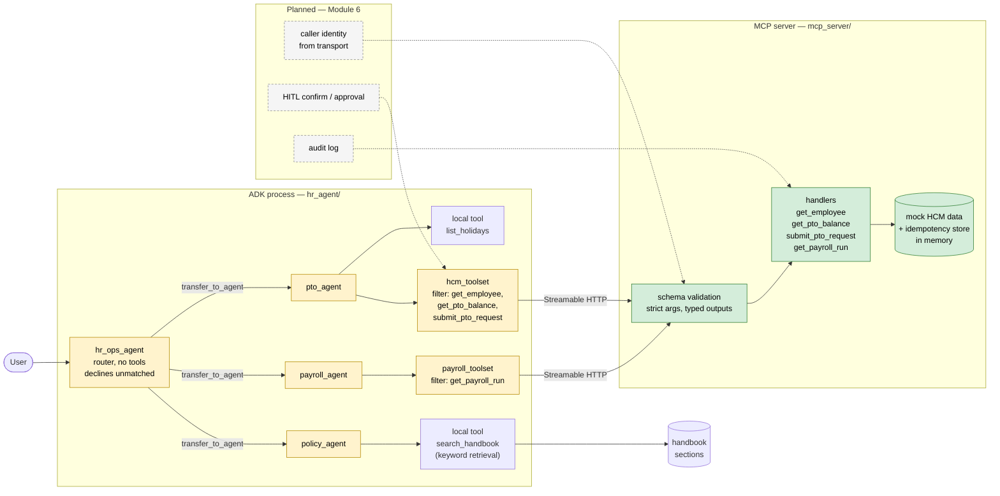

# Architecture

**Legend.** Yellow = soft controls (prompt rules, routing descriptions, `tool_filter`): the
model or in-process config can bypass them. Green = hard controls (schema validation,
server-computed hours, idempotency): enforced regardless of what the model sends. Dashed
grey = planned, not built.

- `list_holidays` is the only remaining local tool; it isn't employee-scoped, so there's no
  caller-identity question for it. `find_employee` and `get_pto_balance` (originally local,
  see M1.8) are retired: balance lookups now go through the MCP layer's `get_pto_balance`,
  self-service only like `get_employee`; name-based lookup has no MCP equivalent and was
  dropped rather than given one (M6.2).
- Each specialist opens its own MCP session; `tool_filter` is per toolset.
- The deterministic-router and LangGraph alternatives live in `scratch/` and are not part
  of this flow.
