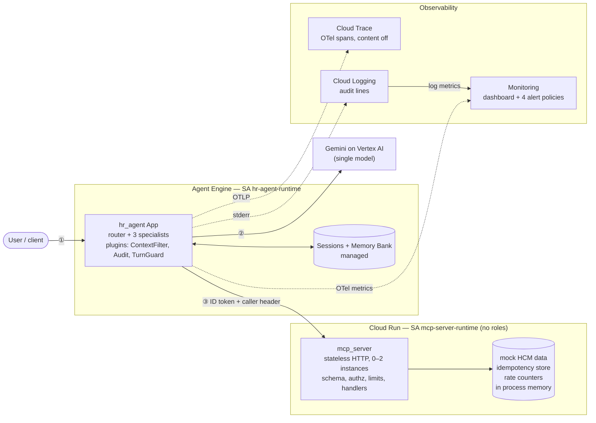

# Reference architecture

The system as deployed (project `hr-ops-agent-509718`, `us-central1`), written so a team can
fork the pattern for another internal-ops agent. Agent topology and the control-flow detail
live in `docs/03-architecture.md`; this doc covers trust boundaries, one write end to end,
the control stack, and what to change first when forking. Facts come from `docs/PROGRESS.md`
and the code; thresholds marked *unmeasured* are judgment calls.

## 1. Components and trust boundaries

| Hop | What authenticates it | What it does not establish |
|---|---|---|
| ① user → Agent Engine | Google IAM on the reasoning-engine API (caller's own credentials). No end-user login: `identify_caller` records a claimed employee ID in session state. | That the person is who they claim. |
| ② engine → Gemini | Runtime SA `hr-agent-runtime`, `roles/aiplatform.user` only. | — |
| ③ engine → `mcp-server` | Cloud Run IAM: Google ID token, audience = service URL, caller must hold `roles/run.invoker` (only `hr-agent-runtime` does). Host-header allowlist (`MCP_ALLOWED_HOSTS`) as a second layer. | Which employee. That comes from `x-caller-employee-id`, set by the agent from session state. The server trusts it from any invoker, so the **only** thing protecting the identity claim is the one invoker SA plus the agent's header provider. |
| observability | Runtime SA with `telemetry.tracesWriter`, `monitoring.metricWriter`. Trace content capture is forced off (`ADK_CAPTURE_MESSAGE_CONTENT_IN_SPANS=false`). | No trace context reaches `mcp_server` (separate traces). |

Infra is Terraform (`deploy/terraform/`: APIs, SAs, IAM, Artifact Registry, `mcp-server`,
dashboard, alerts). The Agent Engine resource is `adk deploy` (`docs/07-deployment-procedure.md`),
the one deliberate exception.

## 2. Request lifecycle: a PTO write

"Take Jul 6–10 off." Order is the order checks run; **bold** is a hard control.

1. **Engine IAM** admits the caller (hop ①). Session created.
2. Router transfers to `pto_agent` (soft: prompt/description routing). Context trimmed to the
   last 6 invocations (`ContextFilterPlugin`).
3. If `caller_employee_id` is unset, `pto_agent` asks for it and calls `identify_caller`
   (soft; a claim, not authentication).
4. Model calls `submit_pto_request`. `TurnGuardPlugin` first checks the 12-call budget
   (*unmeasured*) and that the agent's MCP tools actually loaded; otherwise it ends the turn
   with a fixed message and logs `turn_aborted`.
5. ADK **pauses for user confirmation** (`require_confirmation` on `pto_write_toolset`).
   Human-in-the-loop; reject means no server call.
6. On confirm, `header_provider` attaches the ID token and `x-caller-employee-id`. Cloud Run
   IAM and the Host allowlist admit the request.
7. Server, in order (`mcp_server/handlers.py`): schema validation (ID format, ISO dates, no
   extra args) → **self-only** (`employee_id` must equal the header, else `forbidden`, before any
   lookup) → key format → **rate limit** (20 calls/60s per caller+tool, *unmeasured*) →
   **idempotency** replay or `idempotency_conflict` → not found → dates → hours computed
   server-side → **160h cap** (`exceeds_limit`) → **balance**. Result: `pending` request.
8. `AuditLogPlugin` writes one allowlisted line (caller, tool, `status`/`code`; no balances, no
   error text) and `turn_complete` with duration. Log metrics feed the dashboard and alerts.

Confirmation (step 5) never replaces step 7: a confirmed call from a spoofed or wrong identity
still gets `forbidden`.

## 3. Control stack

| Control | Layer | Hard / soft | What bypasses it |
|---|---|---|---|
| Strict arg schema, typed IDs/dates | MCP server | Hard | Nothing at the protocol layer; semantic mistakes still reach handlers. |
| Self-only / role checks (`Payroll Specialist`, `Finance Director`) | MCP server | Hard, on the claimed identity | A false claim via `identify_caller` or any holder of the invoker role setting the header. |
| Rate limit, 160h cap, server-computed hours, idempotency | MCP server | Hard | Rate counters and idempotency store are per instance and lost on restart (see §5). |
| Confirmation for writes | Agent (ADK) | Hard in ADK, but user-side | A client that auto-confirms; it adds consent, not authorization. |
| Router/specialist prompts, `tool_filter` | Agent | Soft | Prompt injection, model error. Backed by server checks, not relied on. |
| Memory is reference-only, never identity for writes | Prompt | Soft | Model ignores the rule; covered by server self-only check, not tested live. |
| Context trimming, trace content off, audit allowlist | Plugins/config | Hard (deterministic) | A new field added to an audit allowlist or an env var lost on redeploy (two `OTEL_*` vars already vanished once). |
| Turn guard (12 calls, tools-unavailable stop) | Plugin | Hard for runaway loops | Loops under 12 calls; threshold *unmeasured*. |
| Invoker-only access, least-privilege SAs, `prevent_destroy` on the invoker binding | IAM / Terraform | Hard | Project owners; `apply` is manual and reviewed. |
| Alerts: MCP session failures, aborted turns, latency p95, cost/task | Monitoring | Detective | No `alert_email` set means console-only. |

## 4. Decisions and rejected alternatives

| Decision | Rejected | Why |
|---|---|---|
| Caller identity from the transport (header from session state), never a tool argument | Model-supplied `employee_id` as identity | Any model-visible argument can be spoofed or injected. |
| Hard gates in the MCP server; prompts are the soft layer | Prompt-only rules, `tool_filter` as security | The server enforces regardless of model behavior. |
| `mcp_server` as an independent Cloud Run service, stateless HTTP | In-process tools; stateful MCP sessions | Shared and independently deployable. Stateful sessions broke on scale-to-zero/multi-instance (`Session not found`, M8.4). |
| Agent Engine only | Cloud Run / GKE for the agent | No container to run, managed sessions and Memory Bank. Cost: Python 3.11 pin, opaque packaging, silent failed deploys (`docs/07-deployment-tradeoffs.md`). |
| Context trimming (`ContextFilterPlugin`) | LLM summarization (`EventsCompactionConfig`) | Free and deterministic; summarization is still experimental. |
| LLM routing to specialists | ADK `Workflow` or LangGraph | Multi-intent and vague input; Workflow can't be a sub-agent today (`docs/03-adk-vs-langgraph.md`). |
| One model, no tier routing | Flash vs Pro routing | Skipped to avoid billed comparison runs; savings are unmeasured. |
| Terraform for infra, `adk deploy` for the engine | All-Terraform, ad hoc `gcloud` | One owner per resource; the engine's code/env/identity belong to `adk deploy`. |

## 5. Known gaps and scale limits

- **No real authentication.** `identify_caller` is a stub; anyone can claim any employee ID.
  Everything downstream is correct *given* the claim. Real SSO/OIDC is out of scope here.
- **Per-instance state in `mcp_server`:** rate counters and the idempotency store live in
  process memory, with 0–2 Cloud Run instances. Limits are per instance and reset on restart;
  idempotency can miss across instances; the key is unscoped by caller (two employees using
  the same key collide). Needs a shared store before real writes.
- **Mock data, no real HCM integration.** Nothing here has seen real latency, auth or data
  shape.
- **Tracing stops at the MCP boundary.** No `traceparent` propagation, so server time shows
  only as client `MCP send` spans.
- **Cold start counts against the bar.** First MCP call after scale-to-zero took ~4.5s; a
  single cold start can trip the 10s latency alert.
- **Unmeasured thresholds:** 12 model calls/turn, 20 calls/60s, 160h cap, 6 invocations kept,
  eval `response_match_score` 0.3, latency/cost bars.
- **Detection gaps:** task success has no online ground truth (eval gate only); cost per task
  rests on a hand-entered price table; a failed MCP load is caught by the aborted-turns alert,
  not the tool error rate.
- **Eval gate is manual and billed**, runs on `workflow_dispatch` only; no live eval of
  payroll approval or Memory Bank.
- **Deploy hazards:** the `adk deploy` command carries easy-to-forget flags
  (`--extra_packages=mcp_server`, absolute `--env_file`) that failed silently before.
- **Confirmation pauses and rejects log an empty result** in the audit line.

## 6. Forking for a new domain: change first

1. **Identity.** Replace `identify_caller` with a verified login that writes
   `caller_employee_id` into session state; keep the header transport and server checks.
2. **Tools.** Write the new domain's handlers in the MCP server first: strict schemas,
   self-only or role check as the first statement, structured error codes, idempotency keys on
   writes. Then unit and MCP-boundary tests, then specialists.
3. **Shared state.** Move idempotency and rate counters to a shared store scoped by caller.
4. **Write blast radius.** Pick the per-call cap and rate for the new domain's writes from
   real traffic, not these defaults.
5. **Audit allowlist.** Name which fields may appear in logs and traces; everything else drops.
6. **Evals before launch.** Rebuild the three tiers (happy, ambiguous, adversarial) plus a
   dependency-down tier, and re-derive the launch bar.
7. **Observability.** Re-point the log metrics, dashboard and alerts, and set `alert_email`.
8. **Deploy.** Wrap the redeploy command in a script or pipeline so the flag mistakes are
   structurally impossible.

Keep as-is: the transport-identity pattern, hard-gates-in-server rule, the plugin stack,
split read/write toolsets, and the Terraform layout.
